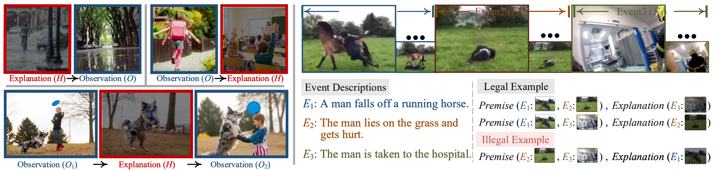

# Visual Abductive Reasoning

  

> This repository is an official PyTorch implementation of paper: 
> [Visual Abductive Reasoning](https://arxiv.org/abs/2203.14040). 
> [Chen Liang](https://leonnnop.github.io/), [Wenguan Wang](https://sites.google.com/view/wenguanwang/), [Tianfei Zhou](https://www.tfzhou.com/), [Yi Yang](https://scholar.google.com/citations?user=RMSuNFwAAAAJ&hl=zh-CN)  
> CVPR 2022.

## Whats-next

This repository works over the data published by the mentioned paper. We work mainly over captions generated on raw images extracted using following rule:

##### For database.json 
> For each video we extract its first frame and middle frame.

> We then apply caption generation deep learning model on these frames and store the captions generated in database.json file.

> [x] TODO: train next frame caption generation model to predict whats next in the video.

##### For database2.json
> [X] TODO: create a bigger dataset.

##### For database3.json
> [X] TODO create even bigger dataset.